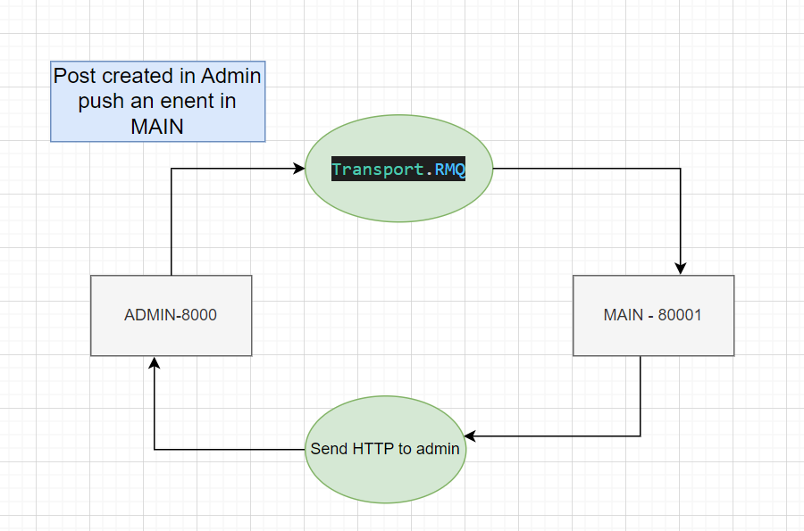

# NESTJS Microfrontend Application

These are two project both have installed @nestjs/microservices

Transporter is RabbitMQ

### admin

=> Databse is mysql
Created a docker-compose.yml to create a DB, which is setup and running, after that setup its configuration with project.
use MYSQL Workbench to create for its connection with docker created mysql.
on starting the nestjs application we can see that Table has been created.

here we create/delete a post it push a event which is listen by main app.

### main

=> Databse is mongodb

Listener to events from admin app, as well make a http call to admin to update the like

### Mockups

